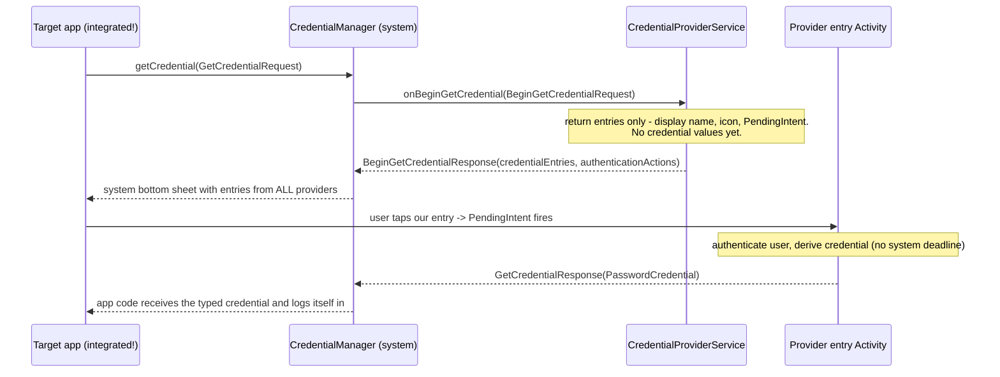

# AutofillService vs CredentialProviderService — Architectural Comparison

Status: **DRAFT — evidence-resolved** (research topic 1, deliverable 3). Citations `[S-n]`
(primary sources) and `[A-n]` (security analyses) resolve to entries in
[source-ledger.md](source-ledger.md); all were verified against the linked official pages on
2026-08-22. Per track rules, remaining unsourced claims are tagged with the experiment
(EXP-nnn) that must reproduce them in the lab
([research/android-credential-lab/](../../research/android-credential-lab/README.md)).

## 1. Why this comparison matters for UpSPA

UpSPA derives per-site credentials from a single master password via threshold TOPRF against
storage providers. On Android that imposes three hard requirements on whichever platform API
we build on:

1. **Extension-like ambient coverage.** The browser extension works on sites that have never
   heard of UpSPA. The Android equivalent must offer credentials inside third-party apps
   *without those apps integrating anything*.
2. **A locked static entry.** Derivation requires the master password and network round-trips,
   so the credential cannot exist at suggestion time. The UI must show a locked placeholder,
   authenticate the user, *then* derive — never pre-derive.
3. **Deferred, potentially slow derivation.** TOPRF needs `t` storage-provider round-trips.
   Whatever callback the platform gives us must tolerate derivation happening *after* user
   interaction, not inside a latency-critical system callback.

## 2. The two APIs at a glance

| Dimension | AutofillService | CredentialProviderService |
| --- | --- | --- |
| Package | `android.service.autofill` | `android.service.credentials` (+ Jetpack `androidx.credentials`) |
| Introduced | API 26 (Android 8.0, 2017) | API 34 (Android 14, 2023) |
| Initiator | System, on view focus — target app passive | Target app, via explicit `CredentialManager.getCredential()` call |
| Unit of exchange | View values (`AutofillValue` written into views) | Typed credential objects returned to app code |
| Detection burden | Provider parses `AssistStructure` and classifies fields | None — requesting app declares what it wants (`GetPasswordOption`, passkeys, ...) |
| Primary UI | Dropdown anchored to field; inline keyboard chips on API 30+ | System-owned bottom sheet / selector |
| Binding permission | `android.permission.BIND_AUTOFILL_SERVICE` | `android.permission.BIND_CREDENTIAL_PROVIDER_SERVICE` |
| Lab artifact | `UpSpaAutofillService.kt` (functional, EXP-001) | `UpSpaCredentialProviderService.kt` (stub) |

The deepest difference is the **initiator**: autofill is a *screen-scraping contract between
the provider and the OS* (apps get filled whether they care or not), while Credential Manager
is an *API contract between the app and the OS* (nothing happens unless the app calls it).
For requirement 1 this is close to decisive on its own — but Phase 4 must still try to
disprove it (Section 8).

## 3. Lifecycle — AutofillService

```mermaid
sequenceDiagram
    participant App as Target app
    participant Sys as Platform (AutofillManager)
    participant Svc as AutofillService
    participant Auth as Provider AuthActivity
    App->>Sys: field focused
    Sys->>Svc: bind + onConnected()
    Sys->>Svc: onFillRequest(FillRequest: fillContexts, clientState, flags)
    Note over Svc: parse AssistStructure, classify fields (5 s system deadline [S-7])
    Svc-->>Sys: FillResponse(setAuthentication(ids, IntentSender, presentation))
    Sys-->>App: locked entry rendered (dropdown or inline chip)
    App->>Auth: user taps entry -> IntentSender fires
    Note over Auth: authenticate user, derive credential (no system deadline here)
    Auth-->>Sys: RESULT_OK + EXTRA_AUTHENTICATION_RESULT (unlocked FillResponse)
    Sys-->>App: dataset entry rendered; user taps; views filled
    App->>Sys: form committed (submit / finish / AutofillManager.commit())
    Sys->>Svc: onSaveRequest(SaveRequest) if SaveInfo matched
    Sys->>Svc: onDisconnected()
```

Load-bearing lifecycle facts (all reproduced or reproducible in the lab):

- **`fillContexts` is a history.** Multi-screen flows deliver earlier screens' structures in
  later requests, which is the platform's answer to split login (EXP-002 stub; Phase 3
  verifies content and limits). `setClientState` lets the provider round-trip its own bundle.
- **The authentication `IntentSender` is the escape hatch from the fill timeout.** The system
  gives the provider **5 seconds** to answer a fill request
  (`TIMEOUT_REMOTE_REQUEST_MILLIS = 5 * DateUtils.SECOND_IN_MILLIS`; on expiry AOSP dispatches
  a cancellation signal and fails the request [S-7]). The API contract requires exactly one
  `onSuccess`/`onFailure` per request, otherwise "the request will eventually time out and be
  discarded" [S-1]. The locked-entry pattern moves all expensive work (user auth + TOPRF)
  into a normal Activity with no system deadline. This is the single most important fit
  between the Autofill API and UpSPA's requirement 3. Measured by `UpSpaLatency` probes;
  cancellation is now logged by the lab provider as direct evidence (EXP-004).
- **Presentations are provider-supplied `RemoteViews`** (plus `InlinePresentation` for
  keyboard chips on API 30+), so the locked entry can look like anything — but inline chips
  render only when the current IME implements the inline suggestions API [S-5]. Per-keyboard
  support (Gboard vs AOSP LatinIME vs OEM keyboards) is an empirical question for EXP-005.

## 4. Lifecycle — CredentialProviderService



Load-bearing lifecycle facts:

- **Entries are references, not values.** `BeginGetCredentialResponse` carries display
  metadata plus a `PendingIntent` per entry; the credential is materialized only in the
  provider's own Activity after the tap. Deferred derivation is therefore *the native shape
  of this API* — arguably a better conceptual fit for UpSPA than autofill's bolted-on
  authentication flow.
- **Locked providers are first-class.** When credentials are locked, the response can carry
  an `AuthenticationAction` ("Authenticate to continue"); after the user completes the
  unlock Activity, the provider returns the now-unlocked entries via
  `PendingIntentHandler.setBeginGetCredentialResponse()` before finishing [S-3].
  Requirement 2 is designed in.
- **The app receives the credential as data.** The provider never touches the app's views;
  the app must wire the returned `PasswordCredential` into its own login logic. This is what
  makes coverage contingent on app adoption.

## 5. UX surfaces

| Surface | AutofillService | CredentialProviderService |
| --- | --- | --- |
| Anchored dropdown | Yes (default, all API levels) | No |
| Inline keyboard chips | API 30+ if the IME supports `InlineSuggestionsRequest` (OEM/keyboard-dependent — topic 2 experiments) | No (but see interplay below) |
| Bottom sheet | No | Yes — system-owned, consistent across apps and providers |
| Presentation control | Provider-rendered `RemoteViews`/`InlinePresentation` (locked entry fully custom) | System renders from entry metadata (icon/title/subtitle) |
| Multi-provider | One autofill service active at a time (user-selected) | Multiple providers aggregated in one sheet; user picks a preferred one |

Android 15 (paired with `androidx.credentials` 1.5.0+) added a bridge between the two
stacks: an app can attach its `GetCredentialRequest` to specific views
(`PendingGetCredentialRequest` / `View.setPendingCredentialRequest`), and Credential Manager
results from all providers then render in autofill-style secondary UI — keyboard inline
chips and the dropdown — as a fallback after the bottom sheet is dismissed [S-8]. Two
audit-relevant caveats: the bridge remains **app-initiated** (it does not restore ambient
coverage for non-integrated apps), and separately, Android 14+ apps can tag fields with
`android:isCredential` to help providers identify credential fields [S-10]. Phase 3 should
capture screenshots of both stacks on the API 34+ emulator.

For the **"Instagram-style experience"** go/no-go (deliverable 7): the autofill dropdown +
inline chip on field focus is exactly the password-manager UX users know from Instagram-class
apps today, on the widest device range. The bottom sheet is arguably *better* UX — but only
in apps that ask for it.

## 6. Minimum API and device reality (topic 9)

| Constraint | AutofillService | CredentialProviderService |
| --- | --- | --- |
| Provider-side floor | API 26 | API 34 |
| Target-app-side floor | API 26, zero app changes | Jetpack client backports to Android 4.4+ for passwords (Play services module on Android 13 and lower; passkeys need Android 9+) [S-4][S-10] — but requires app code changes, and third-party credential *providers* require the device to run Android 14+ [S-3] |
| Lab coverage | api26 / api30 / api34 matrix | api34 only |

Implication for the minimum-version recommendation (draft, to be defended in the report):
**minSdk 26 with the Autofill Framework as the floor**; Credential Manager is additive on
API 34+ and cannot be the floor without abandoning every pre-14 device and every
non-integrated app.

## 7. The UpSPA requirement scorecard: locked entry + slow derivation

| Requirement | AutofillService | CredentialProviderService |
| --- | --- | --- |
| Locked static entry | `FillResponse.setAuthentication()` — proven in the lab (EXP-001) | Entry `PendingIntent`s + authentication actions — designed in, stub only so far |
| Defer derivation past user auth | Yes, inside the auth Activity (no deadline) | Yes, inside the entry Activity (no deadline) |
| System deadline on first callback | Yes — 5 s on `onFillRequest` [S-7]; classification must stay cheap; derivation must NOT happen here | No publicly documented deadline on `onBeginGetCredential`; entries are metadata-only by design, so the callback is cheap by construction — latency envelope to be probed empirically (EXP-006) |
| Works without target-app cooperation | **Yes** (the decisive property) | **No** |

Both APIs pass requirements 2 and 3. Only autofill passes requirement 1.

## 8. Trade-off matrix

| Criterion (weight for UpSPA) | AutofillService | CredentialProviderService |
| --- | --- | --- |
| Coverage without app changes (critical) | Wins — ambient, system-initiated | Fails — app must integrate |
| Minimum device reach (critical) | Wins — API 26+ | API 34+ only |
| Locked-entry fit (critical) | Good (setAuthentication) | Excellent (native shape) |
| Slow-derivation fit (critical) | Good (auth Activity) | Good (entry Activity) |
| Field detection burden (high) | On us — classifier required, WebView/Compose gaps (topics 4, 5, 10) | None — app declares intent |
| UX consistency (medium) | Variable: dropdown vs chips vs OEM keyboards | Consistent system sheet |
| Phishing resistance (high) | Provider must self-enforce package↔domain binding; look-alike and hidden fields are attacker surface [A-1], and WebView screens invite fill-target confusion [A-2] | Framework supplies verified `CallingAppInfo` (package + signing info; `getOrigin()` against a privileged allowlist for browsers acting on behalf of relying parties) [S-3] |
| Passkey future (medium) | None | Native |
| Save/create flow (medium) | `SaveInfo`/`onSaveRequest` — heuristic, browser-dependent | `onBeginCreateCredential` — explicit, app-driven |
| Implementation cost (medium) | Higher (classifier, compat modes, keyboard matrix) | Lower per-flow, but only pays off in integrated apps |

## 9. Preliminary recommendation (hypothesis for Phase 4 disproof)

> **Autofill primary, Credential Manager additive.** Ship the UpSPA Android experience on
> the Autofill Framework (minSdk 26) for ambient coverage; register the same backend as a
> CredentialProviderService on API 34+ for integrated apps and future passkey support.

The Phase 4 disproof attempt must genuinely try to break this, at minimum along:

1. **Compose erosion** — if unhinted Compose apps are invisible to autofill (EXP-003 Arm A)
   and Compose adoption keeps climbing, ambient coverage may be decaying fast enough that
   "autofill primary" is a bet on a shrinking surface.
2. **Browser reality** — if Chrome only honors third-party autofill behind flags/settings
   (topic 5 experiments), web coverage on Android may be weaker than the API story implies.
3. **OEM keyboard fragmentation** — if inline chips fail on major OEM keyboards, the
   perceived UX may regress to the dropdown, weakening the Instagram-style argument.

## 10. Open questions feeding the experiment matrix

| # | Question | Experiment |
| --- | --- | --- |
| 1 | Exact `onFillRequest` deadline and cancellation behavior at high simulated latency | EXP-004 (latency sweep via provider knob) |
| 2 | What do `fillContexts` actually contain on step 2 of split login, per API level | EXP-002 extension |
| 3 | Does the locked entry render as an inline chip on Gboard API 30/34 | EXP-005 (keyboard matrix) |
| 4 | CredentialProviderService end-to-end with a real locked entry | EXP-006 (Phase 2, replaces stub) |
| 5 | Chrome / WebView / compat-mode behavior with the provider enabled | EXP-007 |

## 11. Sourcing status (resolved 2026-08-22)

- [x] AutofillService API reference (lifecycle + timeout-and-discard contract) → S-1, S-2
- [x] Fill request timeout value → S-7 (AOSP `RemoteFillService`, 5 s)
- [x] Credential provider integration guide (Android 14+ floor, capabilities XML) → S-3
- [x] Locked/authentication entry API surface (`AuthenticationAction`, `PendingIntentHandler`) → S-3
- [x] Inline suggestions / IME requirements (API 30) → S-5
- [x] Jetpack `androidx.credentials` backport matrix → S-4, S-10
- [x] Android 15 autofill↔CredMan interplay (`PendingGetCredentialRequest`) → S-8
- [x] Security analyses grounding the phishing rows → A-1 (CCS 2018), A-2 (CODASPY 2023)
- [ ] Empirical residue: per-keyboard inline support (EXP-005); `onBeginGetCredential` latency envelope (EXP-006)
