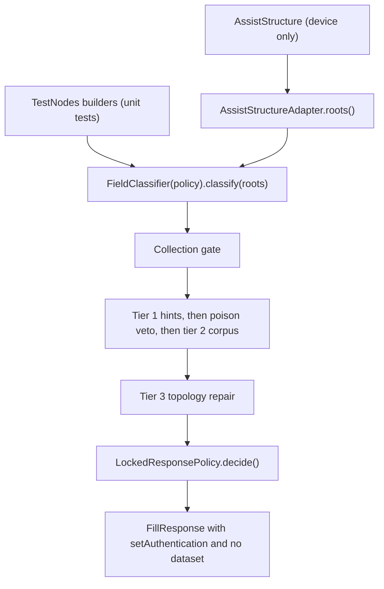

# Android Autofill fixtures and classifier

Author: Emirhan
Target branch: `mobile-dev`
Ownership: `apps/android/fixtures/**`, `apps/android/app/src/main/java/com/upspa/mobile/autofill/**`,
`apps/android/app/src/test/**`

## 1. Scope

The assignment was to expand the controlled Android fixture app, add real tests for the Autofill
field classifier, keep the locked-response behaviour intact, and record API 26 / 30 / 34+ coverage
with documented limitations.

Delivered:

- nine controlled fixture scenarios plus a launcher, replacing the single login form;
- a JVM-testable classifier with injectable safety guards;
- 39 unit tests covering hint tiers, poison terms, topology fallback, hidden and disabled nodes,
  the application's own Autofill opt-out, and unknown fields;
- four negative controls, each proving that one guard can be made to fail;
- manual verification of every fixture scenario on API 26, 30, and 34;
- this report.

## 2. Why the classifier had to be refactored first

`FieldClassifier` previously walked `android.app.assist.AssistStructure` directly. That type and
its `ViewNode` have no public constructor, and Robolectric provides no shadow that can assemble a
node tree, so none of the classification rules could be exercised off-device. The poison regex and
the visible/enabled gates were `private val`s inside an `object`, so there was also no seam through
which a negative control could weaken a single guard.

Three files now separate the platform from the rules:

| File | Responsibility |
| --- | --- |
| [ViewNodeSnapshot.kt](../apps/android/app/src/main/java/com/upspa/mobile/autofill/ViewNodeSnapshot.kt) | Platform-independent description of one node |
| [AssistStructureAdapter.kt](../apps/android/app/src/main/java/com/upspa/mobile/autofill/AssistStructureAdapter.kt) | The only code that touches `AssistStructure` |
| [FieldClassifier.kt](../apps/android/app/src/main/java/com/upspa/mobile/autofill/FieldClassifier.kt) | The rules, parameterized by a `Policy` |

A snapshot carries structural metadata and developer-authored attributes only. It never carries the
text a user typed, which is the same property the classifier itself has always had.

`ViewNodeSnapshot.autofillId` is nullable because `AutofillId` cannot be constructed off-device.
Tests leave it null and set `hasAutofillId` to describe what the platform would have reported, so
the collection gate behaves in a test exactly as it does on a device. `UpspaAutofillService` and
`CredentialAuthActivity` drop any field without an id before building the response, which keeps the
id array and the role array index-aligned.



## 3. Classification rules

### Collection gate

A node becomes a candidate only when all of the following hold. Each is independently testable and
each has a negative control.

1. the platform supplied an autofill id;
2. its autofill type is `AUTOFILL_TYPE_TEXT`;
3. its visibility is `VISIBLE` (so `GONE` and `INVISIBLE` are refused);
4. it is enabled;
5. its `importantForAutofill` mode is not `NO` or `NO_EXCLUDE_DESCENDANTS`.

The walk also stops descending into any subtree marked `NO_EXCLUDE_DESCENDANTS` or
`YES_EXCLUDE_DESCENDANTS`.

`AssistStructure.ViewNode.getImportantForAutofill()` was added in **API 28**, confirmed against the
[API 28 difference report](https://developer.android.com/sdk/api_diff/28/changes/android.app.assist.AssistStructure.ViewNode).
On API 26 and 27 the adapter reports `null` and the classifier treats the node as
`IMPORTANT_FOR_AUTOFILL_AUTO`. A missing signal is never read as "not important", because that
would silently disable filling on the oldest supported release; it is also never read as an
opt-out, because on those releases the platform itself already withholds excluded nodes from the
request.

### Confidence tiers

| Tier | Source | Example |
| --- | --- | --- |
| 1 | platform autofill hint, or an HTML `autocomplete` token | `android:autofillHints="username"`, `autocomplete="current-password"` |
| 2 | attribute corpus plus input type | id `password_change_current`, hint text `Current password` |
| 3 | screen topology | an unlabelled field immediately before a lone password |

The attribute corpus is the view id resource name, the hint text, the content description, and the
HTML `name`, `id`, `placeholder`, and `label` attributes. It never includes field content.

### The poison veto

A field whose corpus matches
`search|captcha|coupon|promo|gift|card.?number|cvv|cvc|expir|amount|city|zip|postal|street|address`
is refused outright and cannot be promoted by the topology stage either.

The veto runs **before every other signal, including tier 1**. `classifyField` checks it first,
ahead of the platform-hint lookup and the HTML `autocomplete` lookup, so it is a true veto rather
than a tie-breaker. A node cannot buy its way past it by also carrying a hint: a masked checkout
CVC field that declares `android:autofillHints="password"`, or a WebView node whose corpus mentions
"security code" while its HTML `autocomplete` says `current-password`, is still classified as
`UNKNOWN` and never returned as fillable. This is what stops a card security code, which is a
masked numeric input and therefore looks exactly like a password, from being filled with a
credential even when the surrounding markup misdeclares it — `FieldClassifierTest.a masked payment
field is refused even though it looks like a password`, `a poison term outranks a platform autofill
hint on the same node`, and `a poison term outranks an HTML autocomplete hint on the same node` pin
this, and NC-1 proves the guard is load-bearing by removing it and observing the poisoned field
become fillable.

The veto is per-node: a poisoned field on a screen does not suppress a genuine, separately hinted
field elsewhere on the same screen (`a poison hit on an unrelated field does not affect a genuine
hinted field on the same screen`).

## 4. The locked response

[LockedResponsePolicy](../apps/android/app/src/main/java/com/upspa/mobile/autofill/LockedResponsePolicy.kt)
turns a classification into one of three decisions:

- `None` — the service answers the platform with a null response;
- `LockedEntry` — one generic entry, guarded by authentication;
- `UnlockedEntry` — reachable only from a negative control.

The security property is structural rather than procedural: `LockedEntry` holds the classified
fields and **has no member capable of holding a value**. The service converts it into a
`FillResponse` built with `setAuthentication(ids, intentSender, presentation)` and no dataset, so
no value is computed for, or handed to, the requesting application until `CredentialAuthActivity`
has run inside UpSPA's own process with `FLAG_SECURE` set.

Refusals are now logged as explicitly as offers:

```
locked response target=com.upspa.mobile.fixtures roles=USERNAME:T1,PASSWORD_CURRENT:T1
no response target=com.upspa.mobile.fixtures reason=nothing-classified
```

This is a deliberate divergence from the original plan. Without it, "the service correctly refused"
and "the service crashed" are indistinguishable in logcat, which would make the negative scenarios
unverifiable. The reason is one of a fixed set of tokens (`no-structure`, `unknown-package`,
`nothing-classified`, `no-addressable-id`, `canceled`) and nothing derived from the requesting
screen's content is written to the log. `Result.safeSummary()` emits roles and tiers only; `the
safe summary exposes roles and tiers but no attribute text` asserts that.

## 5. The fixture app

Nine scenarios, reachable from `FixtureMenuActivity`. Every screen uses an XML layout with named
`@+id/...` resources.

**This was a required change, not a preference.** The previous fixture assigned ids with
`View.generateViewId()`, which produces no `idEntry`. Tier-2 corpus matching reads `idEntry`, so on
a device the old fixture could never exercise tier 2 at all.

Each screen focuses its first field on launch through `<requestFocus />`, so opening the Activity
raises a fill request as soon as it appears.

| # | Activity | What it exercises | Expected decision |
| --- | --- | --- | --- |
| 1 | `LoginActivity` | tier-1 platform hints | `USERNAME:T1,PASSWORD_CURRENT:T1` |
| 2 | `RegistrationActivity` | hint-free confirmation field | `EMAIL:T1,PASSWORD_NEW:T1,PASSWORD_NEW:T3` |
| 3 | `PasswordChangeActivity` | current versus new discrimination | `PASSWORD_CURRENT:T3,PASSWORD_NEW:T1,PASSWORD_NEW:T3` |
| 4a | `SplitUsernameActivity` | identifier-only step | `USERNAME:T1` |
| 4b | `SplitPasswordActivity` | password-only step | `PASSWORD_CURRENT:T1` |
| 5 | `NoHintsLoginActivity` | tier-3 topology promotion | `USERNAME:T3,PASSWORD_CURRENT:T2` |
| 6 | `HiddenAndDisabledActivity` | gone, invisible, disabled traps | `USERNAME:T1,PASSWORD_CURRENT:T1` |
| 7 | `PoisonFieldsActivity` | payment and search fields | `USERNAME:T1,PASSWORD_CURRENT:T1` |
| 8 | `AutofillDisabledActivity` | `noExcludeDescendants` opt-out | no response |
| 9 | `UnknownFieldsActivity` | ordinary non-credential fields | no response |

Scenario 6 places three traps that all carry valid autofill hints: a `GONE` password, an
`INVISIBLE` username, and a disabled password. Filling any of them would write a credential
somewhere the user cannot see, so the correct decision offers only the two live fields.

Scenario 7 is a checkout page containing a search box, a coupon code, a card number, a card
security code, and a postal code, next to a genuine sign-in box. Only the sign-in box is offered.

No fixture reads, submits, logs, or persists what is typed. The submit button is wired once, in
`FixtureActivity`, to show a toast and nothing else, so a reviewer can confirm the property in one
place.

## 6. Tests

```
./apps/android/gradlew -p apps/android :app:testDebugUnitTest
```

Result of the last clean run (`--rerun-tasks`):

```
com.upspa.mobile.autofill.FieldClassifierTest:               tests=28 failures=0 errors=0 skipped=0
com.upspa.mobile.autofill.FieldClassifierNegativeControlTest: tests=6 failures=0 errors=0 skipped=0
com.upspa.mobile.autofill.LockedResponsePolicyTest:           tests=5 failures=0 errors=0 skipped=0
BUILD SUCCESSFUL
```

39 tests, 0 failures, 0 skipped.

Coverage by area:

- **tier 1 platform hints** — username, email, new username, new password, SMS OTP; an
  unrecognised hint does not become a fill target on its own;
- **tier 1 HTML autocomplete** — `username`, `current-password`, `new-password`, `one-time-code`,
  a sectioned value (`section-blue billing username`), and `type="password"`;
- **tier 2 corpus** — the hint-free registration confirmation field, current versus new password
  discrimination, and an identifier recognised from a content description alone;
- **poison veto** — the whole checkout screen, the masked security code, and the precedence rules
  in both directions;
- **collection gate** — `GONE`, `INVISIBLE`, disabled, missing autofill id, and non-text
  autofill type;
- **importantForAutofill** — `NO`, `NO_EXCLUDE_DESCENDANTS` on a container,
  `YES_EXCLUDE_DESCENDANTS`, and the null case that API 26 and 27 produce;
- **tier 3 topology** — promotion of an unlabelled field, refusal to promote a poison field,
  refusal to invent a target on a password-only screen, and two-password registration;
- **unknown screens** — a preferences form and an empty structure;
- **logging safety** — `safeSummary()` redaction.

## 7. Negative controls

Rule 7 requires that every security-critical behaviour has a control proving the check can fail.
Four guards qualify. Each is disabled through the module-internal `FieldClassifier.Policy`
constructor, which production code never uses:
`FieldClassifier.classify(AssistStructure)` is the only entry point the service calls and it is
hard-wired to `Policy.DEFAULT`.

| Control | Guard disabled | Observed unsafe outcome |
| --- | --- | --- |
| NC-1 | poison veto | a card security code is classified `PASSWORD_CURRENT`; a search box is classified `USERNAME`; the topology stage promotes a search box to `USERNAME` at tier 3 |
| NC-2 | visibility and enabled gates | the `GONE`, `INVISIBLE`, and disabled traps all become fillable, 5 fields instead of 2 |
| NC-3 | `importantForAutofill` gate | the form the application excluded with `noExcludeDescendants` becomes fillable |
| NC-4 | pre-authentication lock | the decision becomes an `UnlockedEntry` carrying `template-user` and `UPSPA-TEMPLATE-NOT-A-REAL-CREDENTIAL` before the protected Activity has run |

These live in
[FieldClassifierNegativeControlTest.kt](../apps/android/app/src/test/java/com/upspa/mobile/autofill/FieldClassifierNegativeControlTest.kt)
and each is paired with an assertion of the safe outcome under `Policy.DEFAULT`.

### Procedure: deliberately weakening the shipped default

The controls above weaken a guard through a test-only constructor. To show that the guard shipped
in production code is the one doing the work, weaken the default itself.

1. In [FieldClassifier.kt](../apps/android/app/src/main/java/com/upspa/mobile/autofill/FieldClassifier.kt),
   replace the body of `Policy.DEFAULT_POISON` with a regex that never matches:

   ```kotlin
   val DEFAULT_POISON = Regex("(?!)")
   ```

2. Run `./apps/android/gradlew -p apps/android :app:testDebugUnitTest`.
3. Revert the change.

**Result actually observed:**

```
FieldClassifierNegativeControlTest > NC-1 weakening the poison veto also lets topology promote a search box FAILED
FieldClassifierNegativeControlTest > NC-1 default policy refuses a card security code and a search box FAILED
FieldClassifierTest > checkout fields are refused while the sign-in box is still offered FAILED
FieldClassifierTest > the topology fallback refuses to promote a poison field FAILED
FieldClassifierTest > a poison term outranks an identifier term in the same corpus FAILED
FieldClassifierTest > a masked payment field is refused even though it looks like a password FAILED
39 tests completed, 6 failed
```

with assertion messages naming the exact fields that leaked:

```
expected:<[poison_login_username, poison_login_password]>
but was:<[poison_card_cvv, poison_login_username, poison_login_password]>

expected:<[field_beta]> but was:<[store_search, field_beta]>
expected:<UNKNOWN> but was:<USERNAME>
expected:<[]> but was:<[card_cvc]>
```

The suite returned to 39 passing after the revert.

## 8. API coverage

Every fixture scenario was walked by hand on three emulator images. The Autofill dropdown, the
locked UpSPA entry, the unlock Activity, and the fill (or the absence of a fill) were confirmed
on each screen.

| API level | Device | Manual fill-through |
| --- | --- | --- |
| 26 | `API_26` (`google_apis_playstore`, x86) | pass |
| 30 | `Pixel_5` (`google_apis`, x86_64) | pass |
| 34 | `Pixel_8` (`google_apis_playstore`, x86_64) | pass |

On each API level the locked entry appeared only on the credential screens, poison and unreachable
fields stayed empty after a fill, and the Autofill-disabled and unknown-field screens produced no
UpSPA entry at all.

## 9. Manual verification guide

### 9.1 Prerequisites

- JDK 17 or newer, Android SDK 35, `ANDROID_HOME` set.
- An emulator or device at API 26, 30, or 34.
- **On Windows the checkout path must be ASCII.** AGP refuses to build under a path containing
  characters such as `ü` or `İ`, and `-Pandroid.overridePathCheck=true` does not work as a
  command-line flag because AGP reads that property only from `gradle.properties`. Clone to
  something like `C:\src\UpSPA_extension`. This is discussed in
  [section 11](#11-known-limitations).

### 9.2 Build and unit tests

From the repository root:

```powershell
.\apps\android\gradlew.bat -p apps\android :app:testDebugUnitTest
.\apps\android\gradlew.bat -p apps\android :app:assembleDebug :fixtures:assembleDebug
```

Expected: `BUILD SUCCESSFUL`, 39 tests, 0 failures. The HTML report is at
`apps/android/app/build/reports/tests/testDebugUnitTest/index.html`.

### 9.3 Install and enable Autofill

```powershell
adb install -r -t apps\android\app\build\outputs\apk\debug\app-debug.apk
adb install -r -t apps\android\fixtures\build\outputs\apk\debug\fixtures-debug.apk
```

Open **UpSPA Mobile Bootstrap** and tap **Enable UpSPA Autofill**, or set it from the device:

```powershell
adb shell settings put secure autofill_service com.upspa.mobile.debug/com.upspa.mobile.autofill.UpspaAutofillService
adb shell settings get secure autofill_service
```

The get command must print
`com.upspa.mobile.debug/com.upspa.mobile.autofill.UpspaAutofillService`.

### 9.4 Fill-through, once per API level

Repeat this walk on API 26, 30, and 34. Every fixture focuses its first field on launch, so opening
a screen is enough to raise a fill request.

1. Launch **UpSPA Autofill Fixtures** and open **1. Login (platform hints)**.
2. Confirm a single entry appears, labelled **Unlock UpSPA Mobile (template)**.
   *This is the locked response: one generic entry, no account name, no preview of any value.*
3. Tap it. The UpSPA unlock screen opens.
   *Confirm that a screenshot or a screen recording of this Activity is blocked, which is
   `FLAG_SECURE` working.*
4. Tap **Continue with template credential**.
5. Confirm the username field now reads `template-user` and the password field is filled.
   *Every value is synthetic; `UPSPA-TEMPLATE-NOT-A-REAL-CREDENTIAL` is not a credential.*
6. Open **2. Registration**, **3. Password change**, **4. Split username / password login**
   (both steps), and **5. No hints**. Each should offer the same generic UpSPA entry and fill only
   the credential fields listed for that screen in [section 5](#5-the-fixture-app).
7. Open **7. Poison fields next to a login**.
8. Focus **Search this store**, then **Coupon code**, **Card number**, **Card security code**, and
   **Postal code** in turn. **No UpSPA entry may appear on any of them.**
9. Focus **Username**. The UpSPA entry appears. Select it and confirm that the five fields in
   step 8 are still empty afterwards.
10. Open **6. Hidden and disabled fields**, select the UpSPA entry, then confirm the disabled
    password field is still empty.
11. Open **8. Autofill explicitly disabled** and focus either field. **No UpSPA entry may appear.**
12. Open **9. Unknown, non-credential fields**. **No UpSPA entry may appear.**

Steps 8, 11, and 12 are the ones that matter most: they are the cases where the correct behaviour
is that UpSPA does nothing at all.

### 9.5 Result of this walk

The procedure above was completed on API 26, 30, and 34. All nine scenarios behaved as in the
table in [section 5](#5-the-fixture-app).

## 10. Security considerations

- **No value exists before authentication.** The pre-authentication decision type has no field that
  can hold one. NC-4 shows what removing that produces.
- **Unsafe fields are refused, not merely deprioritised.** A poison match returns `UNKNOWN`, which
  excludes the field from `fillable`, from the authentication id array, and from the topology
  fallback.
- **Invisible and unreachable fields are refused**, so a credential cannot be written where the
  user cannot see it.
- **The application's own opt-out is honoured in UpSPA's code**, not only by the platform, so the
  behaviour does not depend on an OEM's traversal implementation.
- **Logging is structural only.** Roles, tiers, the requesting package, and a fixed refusal token.
  No corpus, no attribute text, no field content. Enforced by a test.
- **Values are synthetic by construction.** `TemplateCredentialEngine` returns strings containing
  `UPSPA-TEMPLATE` or the reserved `.invalid` domain. No real, derived, or reusable secret appears
  anywhere in this work, including in the tests and in this document.
- **`onSaveRequest` still does nothing.** Submitted values are not inspected.
- The `:app` module still has no `INTERNET` permission and the `:fixtures` module has no
  permissions at all.

## 11. Known limitations

**WebView.** HTML rules depend on `ViewNode.getHtmlInfo()`, which is populated by the WebView
implementation rather than by the framework. Coverage varies with the installed WebView version and
with OEM builds, and some WebViews report no `htmlInfo` at all, in which case a web form degrades to
tier 2 and tier 3. The unit tests cover the rules but no fixture renders a real WebView, so the
end-to-end WebView path is untested here.

**Custom views.** A custom view that does not implement
`onProvideAutofillVirtualStructure()` supplies no addressable `AutofillId`, and UpSPA cannot fill
it. This is a platform contract, not something the classifier can work around. No fixture covers it.

**Jetpack Compose.** Compose autofill support has changed substantially across Compose versions and
semantics-based autofill is not equivalent to the View-based structure the classifier reads. The
fixtures are deliberately View-based so that the classifier is tested against a stable contract.
UpSPA's own `CredentialAuthActivity` is Compose, but it is the receiving side and is not classified.
Compose fixture coverage is deferred.

**OEM builds.** Whether `GONE` nodes appear in the structure at all, and how aggressively
`importantForAutofill` is honoured before the request reaches the service, are OEM-dependent. The
classifier therefore re-checks both rather than trusting the platform to have filtered them. All
recorded coverage is from emulator images; no physical OEM device was tested.

**Third-party keyboards.** Inline suggestions (API 30+) are rendered by the IME, and a keyboard
that does not implement them falls back to the dropdown. UpSPA does not implement
`InlineSuggestionsRequest`, so inline presentation is untested and unsupported for now.

**API 26 and 27.** `getImportantForAutofill()` does not exist, so UpSPA cannot re-check the
application's opt-out on those releases and relies on the platform having withheld excluded nodes.
The behaviour is safe by default but is weaker than on API 28+.

**Windows non-ASCII paths.** AGP refuses to build and the check cannot be overridden from the
command line. Documented in the README as a clone-path requirement rather than worked around,
because `android.overridePathCheck=true` would have to be committed to a shared
`gradle.properties`.

## 12. Deferred integration work

- Replace `TemplateCredentialEngine` with the reviewed UniFFI command/effect boundary. The
  classifier's `Role` enum is the interface that the engine will consume.
- Implement the Credential Manager path properly; the API 34 service is still a registration stub.
- Add instrumented `androidTest` coverage that drives the system Autofill dropdown, once a stable
  way to address it exists.
- Add a WebView fixture and a Compose fixture.
- Implement `InlineSuggestionsRequest` for API 30+ keyboards.

## 13. Files changed

Owned:

- `apps/android/app/src/main/java/com/upspa/mobile/autofill/ViewNodeSnapshot.kt` (new)
- `apps/android/app/src/main/java/com/upspa/mobile/autofill/AssistStructureAdapter.kt` (new)
- `apps/android/app/src/main/java/com/upspa/mobile/autofill/LockedResponsePolicy.kt` (new)
- `apps/android/app/src/main/java/com/upspa/mobile/autofill/FieldClassifier.kt`
- `apps/android/app/src/main/java/com/upspa/mobile/autofill/UpspaAutofillService.kt`
- `apps/android/app/src/test/java/com/upspa/mobile/autofill/` (new, 4 files)
- `apps/android/fixtures/src/main/java/com/upspa/mobile/fixtures/` (`MainActivity.kt` replaced by
  `FixtureMenuActivity.kt`, `FixtureActivity.kt`, `Scenarios.kt`)
- `apps/android/fixtures/src/main/res/layout/` (new, 9 files)
- `apps/android/fixtures/src/main/res/values/strings.xml`
- `apps/android/fixtures/src/main/AndroidManifest.xml`
- `apps/android/README.md`
- `docs/emirhan-android-autofill-fixtures-classifier.md` (this file)

Adjacent, in the same Autofill path:

- `apps/android/app/src/main/java/com/upspa/mobile/secureui/CredentialAuthActivity.kt` — filters
  fields without an autofill id so the id and role arrays stay aligned. No change to the security
  model.

Shared integration files:

- `apps/android/gradle/libs.versions.toml` — **one additive change**, a `junit = "4.13.2"` version
  and the matching library entry. Nothing existing was modified or removed.
- `apps/android/app/build.gradle.kts` — `testImplementation(libs.junit)` and
  `testOptions { unitTests.isReturnDefaultValues = true }`.
- `apps/android/settings.gradle.kts` — **not modified**. No module was added.
- `Cargo.toml`, `Cargo.lock` — **not modified**.
